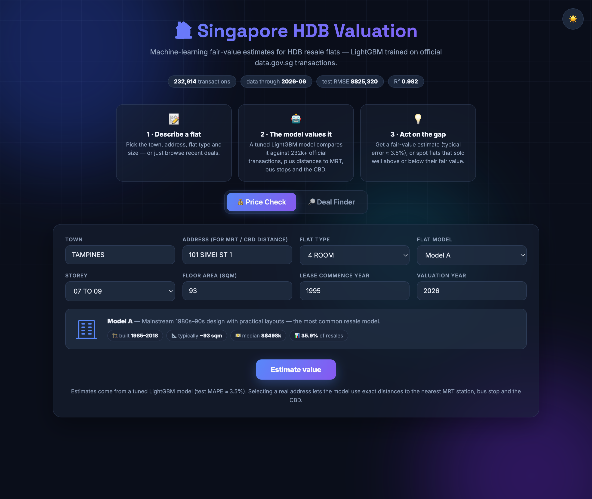
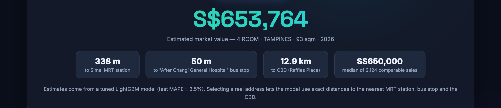
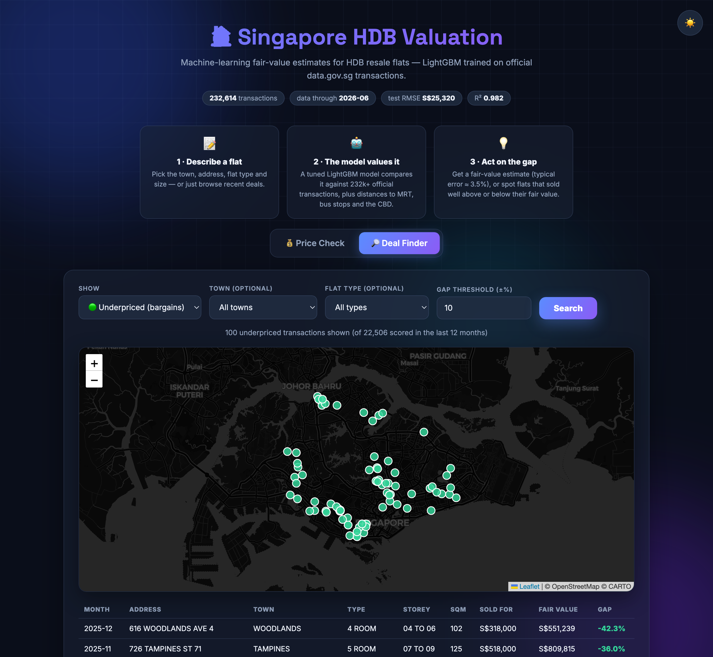

# 🏠 Singapore HDB Resale Price Analysis & Prediction

End-to-end machine learning project: **232k+ public-housing resale transactions** (2017–present) analysed
with pandas, priced with a **tuned LightGBM model**, and served through an **interactive web app + Streamlit
dashboard** that estimate any flat's market value and flag **overpriced / underpriced** transactions.



<table>
  <tr>
    <td width="50%"></td>
    <td width="50%"></td>
  </tr>
  <tr>
    <td align="center"><b>💰 Price Check</b> — instant fair-value estimate with the nearest named MRT station, bus stop &amp; CBD distance</td>
    <td align="center"><b>🔎 Deal Finder</b> — recent transactions mapped by how far they sold above/below model fair value</td>
  </tr>
</table>

| | |
|---|---|
| **Data** | Official resale records from [data.gov.sg](https://data.gov.sg) (Datastore API), enriched with geocoded coordinates (OneMap) and MRT/bus locations (OpenStreetMap) |
| **Models** | Linear Regression → Random Forest → LightGBM → **LightGBM + Optuna** (Bayesian hyperparameter tuning) |
| **Best test metrics** | RMSE **S$25,320** · MAE **S$17,889** · R² **0.982** · MAPE **3.48%** |
| **Apps** | 5-page Streamlit analytics dashboard **+** standalone web app (FastAPI REST API + vanilla-JS frontend with Leaflet deal map) |

## 📓 Notebooks — the documented analysis

The full process is documented in five executed Jupyter notebooks:

| # | Notebook | What it covers |
|---|----------|----------------|
| 1 | [Data collection & cleaning](notebooks/01_data_collection_and_cleaning.ipynb) | API ingestion, data dictionary, quality audit (missing/dupes/ranges) |
| 2 | [Exploratory data analysis](notebooks/02_exploratory_data_analysis.ipynb) | Market trend (+60% since 2017), town/flat-type/storey/lease effects |
| 3 | [Feature engineering](notebooks/03_feature_engineering.ipynb) | Time index, lease parsing, geocoding 9.7k addresses, BallTree MRT/CBD distances |
| 4 | [Model building & tuning](notebooks/04_model_building_and_tuning.ipynb) | Baselines, Optuna TPE search (30 trials), chronological validation, residual diagnostics |
| 5 | [Over/under-priced analysis](notebooks/05_overpriced_underpriced_analysis.ipynb) | Leakage-free valuation engine, deal detection at ±10% fair-value bands |

## 🖥️ Dashboard

```bash
make dashboard        # = streamlit run app/dashboard.py
```

- **📊 Price trends** — monthly medians, distributions, area-vs-price by flat type
- **🗺️ Town comparison** — rankings, town × flat-type heatmap
- **🌏 Map view** — per-block prices on an interactive map with MRT overlay
- **🤖 Price prediction** — enter a flat's attributes (real address → live MRT/bus/CBD distances) and get a valuation
- **💰 Deal finder** — browse recent transactions priced above/below model fair value, on a map and in ranked tables

## 🌐 Web app (FastAPI + JS)

```bash
make webapp           # = uvicorn app.api:app --port 8000  →  http://localhost:8000
```

A standalone single-page app backed by a REST API ([app/api.py](app/api.py), docs auto-generated at `/docs`):

| Endpoint | Purpose |
|----------|---------|
| `GET /api/meta` | Towns, flat types/models, data coverage, model test metrics |
| `GET /api/addresses?town=` | Geocoded addresses for a town |
| `POST /api/predict` | Fair-value estimate for a flat (real address → exact MRT/bus/CBD distances) |
| `GET /api/deals?kind=under` | Under/over-priced recent transactions, filterable |

The frontend ([app/static/index.html](app/static/index.html)) is dependency-free vanilla JS with a
Leaflet map — **💰 Price Check** estimates any flat's value with comparable-sales context, and
**🔎 Deal Finder** maps the biggest bargains and overpayments of the last 12 months.

## 🚀 Deploy the web app

The repo ships with everything the web app needs (data, geocoded coordinates, trained model), plus a
[render.yaml](render.yaml) blueprint — on [Render](https://render.com): **New → Blueprint → select this
repo** and it goes live on the free tier. Any other Python host works the same way:

```bash
pip install -r requirements-web.txt && pip install -e . --no-deps
uvicorn app.api:app --host 0.0.0.0 --port $PORT
```

> The 775MB Random Forest pickle is excluded from the repo (GitHub's 100MB limit); the production
> LightGBM model is included. Rebuild the RF locally with `make train` if you want the dashboard's
> model-comparison option.

## 🔁 Reproduce everything

```bash
pip install -r requirements.txt && pip install -e .

make fetch       # 1. download 232k+ transactions from data.gov.sg
make transit     # 2. MRT stations + bus stops from OpenStreetMap
make geocode     # 3. geocode 9.7k unique addresses via OneMap (~30 min, rate-limited)
make notebooks   # 4. execute notebooks 01–05 (features → tuned model → valuations)
make dashboard   # 5. launch the app
```

`make train` runs the standalone training script (same pipeline as notebook 4, without the tuning study).

## 🧠 Key technical points

- **Geospatial features pay off**: geocoding every address and computing nearest-MRT / CBD / bus-stop
  distances with a haversine BallTree cut MAE by ~25% vs the no-spatial baseline; spatial features take
  4 of the top-7 importance slots.
- **No train/serve skew**: feature logic lives in one package (`sg_hdb_price_analysis`), imported by
  notebooks, the training script and the dashboard alike. Model artifacts bundle the encoder +
  imputation medians.
- **Honest evaluation**: in addition to a random split, the model is validated on a strict
  chronological split (train ≤ cutoff, test on the final 6 months) — forward-looking RMSE is
  S$35,305 (R² 0.972), quantifying the real cost of predicting an unseen, rising market and
  motivating monthly retrains.
- **Leakage-free valuations**: the deal finder scores the last 12 months with a model trained only on
  older data, so "fair value" is always an out-of-sample prediction.

## Project structure

```
├── app/dashboard.py            <- Streamlit dashboard (5 pages)
├── data
│   ├── raw/                    <- Immutable API dump (232k+ transactions)
│   ├── external/               <- Geocoded coords, MRT stations, bus stops
│   ├── interim/                <- Cached feature matrix (parquet)
│   └── processed/              <- Model comparison, importances, valuations
├── models/                     <- Trained model artifacts (.pkl)
├── notebooks/                  <- 01–05: the documented analysis (executed)
├── reports/figures/            <- Charts exported by the notebooks
└── sg_hdb_price_analysis/      <- Source package
    ├── data/                   <- fetch.py (API), geocode.py (OneMap), transit.py (OSM)
    ├── features/               <- engineering.py, spatial.py (BallTree)
    └── models/                 <- train.py, experiment.py
```
